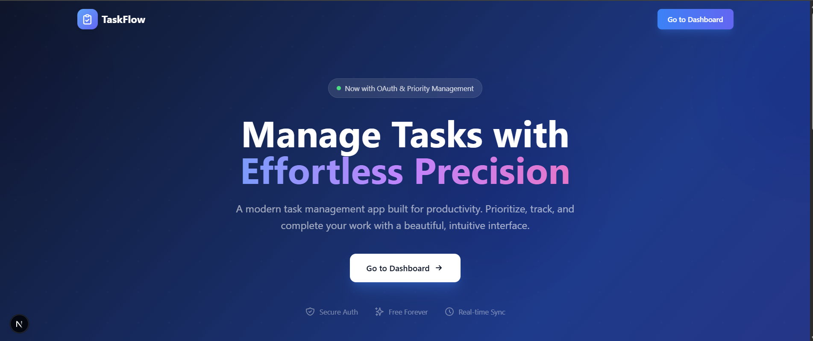

<p align="center">
  
</p>

<h1 align="center">TaskFlow Frontend</h1>

<p align="center">
  <strong>Next.js 16 Frontend for TaskFlow Task Management App</strong>
</p>

<p align="center">
  
  
  
  
</p>

---

## Features

| Feature | Description |
|---------|-------------|
| **Modern Landing Page** | Beautiful gradient design with animations |
| **User Authentication** | Sign up, sign in with form validation |
| **OAuth Integration** | Google and GitHub social login |
| **Task Dashboard** | Statistics, search, and filter functionality |
| **Task Management** | Create, edit, complete, and delete tasks |
| **Priority System** | Low, Medium, High, Urgent with color coding |
| **Due Dates** | Set and track task deadlines |
| **Tags** | Organize tasks with custom tags |
| **Responsive Design** | Mobile-first, works on all devices |
| **Real-time Search** | Debounced search with instant results |

---

## Quick Start

```bash
# Install dependencies
npm install

# Create environment file
cp .env.example .env.local

# Edit .env.local
NEXT_PUBLIC_API_URL=http://localhost:8000

# Run development server
npm run dev
```

Open [http://localhost:3000](http://localhost:3000) in your browser.

---

## Environment Variables

Create `.env.local` in the frontend folder:

```bash
# Backend API URL
NEXT_PUBLIC_API_URL=http://localhost:8000
```

---

## OAuth Setup

OAuth credentials are configured in the **backend** `.env` file. The frontend just redirects to the backend OAuth endpoints.

### Google OAuth

1. Go to [Google Cloud Console](https://console.cloud.google.com/)
2. Create/Select a project
3. Go to "APIs & Services" > "Credentials"
4. Create "OAuth client ID" (Web application)
5. Add origins and redirect URIs:
   ```
   Authorized JavaScript origins:
   - http://localhost:3000
   - http://localhost:8000

   Authorized redirect URIs:
   - http://localhost:8000/api/auth/google/callback
   ```
6. Copy credentials to backend `.env`:
   ```bash
   GOOGLE_CLIENT_ID=your-client-id.apps.googleusercontent.com
   GOOGLE_CLIENT_SECRET=your-client-secret
   ```

### GitHub OAuth

1. Go to [GitHub Developer Settings](https://github.com/settings/developers)
2. Create "New OAuth App"
3. Fill in:
   ```
   Application name: TaskFlow
   Homepage URL: http://localhost:3000
   Authorization callback URL: http://localhost:8000/api/auth/github/callback
   ```
4. Copy credentials to backend `.env`:
   ```bash
   GITHUB_CLIENT_ID=your-client-id
   GITHUB_CLIENT_SECRET=your-client-secret
   ```

### Test OAuth

1. Start backend: `uv run uvicorn src.interfaces.api:app --reload --port 8000`
2. Start frontend: `npm run dev`
3. Go to http://localhost:3000/signin
4. Click "Google" or "GitHub" button
5. Authorize and you'll be redirected to dashboard

---

## Project Structure

```
frontend/
├── app/                      # Next.js App Router
│   ├── layout.tsx            # Root layout with metadata
│   ├── page.tsx              # Landing page (/)
│   ├── signin/page.tsx       # Sign in page
│   ├── signup/page.tsx       # Sign up page
│   ├── dashboard/page.tsx    # Task dashboard
│   └── auth/callback/page.tsx # OAuth callback handler
├── components/               # React components
│   ├── auth-form.tsx         # Auth form with OAuth buttons
│   ├── header.tsx            # Dashboard header with user menu
│   ├── task-list.tsx         # Task list with sorting
│   ├── task-card.tsx         # Individual task card
│   ├── task-form.tsx         # Create/edit task form
│   └── loading.tsx           # Loading spinner
├── lib/                      # Utilities
│   ├── auth-client.ts        # JWT auth helpers
│   └── api-client.ts         # API client with auth
├── public/                   # Static assets
│   └── mainpage.png          # Screenshot
└── .env.example              # Environment template
```

---

## Components

### Landing Page (`app/page.tsx`)
- Hero section with gradient background
- Feature cards with hover effects
- Call-to-action buttons
- Footer with social links

### Dashboard (`app/dashboard/page.tsx`)
- Welcome header with greeting
- Statistics cards (Total, Pending, Completed, Rate)
- Search bar with debounce
- Filter tabs (All, Pending, Completed)
- Task list with sorting

### Task Card (`components/task-card.tsx`)
- Priority indicator bar
- Completion checkbox
- Title, description, tags display
- Due date with overdue detection
- Edit and delete actions

### Auth Form (`components/auth-form.tsx`)
- Email/password validation
- OAuth buttons (Google, GitHub)
- Error handling
- Loading states

---

## Scripts

```bash
# Development
npm run dev          # Start dev server (webpack mode for WSL)

# Build
npm run build        # Production build
npm run start        # Start production server

# Quality
npm run lint         # Run ESLint
npm run lint:fix     # Fix lint issues
```

---

## Styling

Uses **Tailwind CSS 4** with custom configuration:

- **Colors**: Slate, Blue, Purple, Emerald, Amber, Red
- **Gradients**: Used throughout for modern look
- **Animations**: Subtle hover effects and transitions
- **Responsive**: Mobile-first breakpoints (sm, md, lg)

---

## API Integration

The frontend communicates with FastAPI backend:

### Auth Endpoints
```typescript
POST /api/auth/signup    // Create account
POST /api/auth/signin    // Sign in
POST /api/auth/signout   // Sign out
GET  /api/auth/me        // Get current user
GET  /api/auth/google    // Start Google OAuth
GET  /api/auth/github    // Start GitHub OAuth
```

### Task Endpoints
```typescript
GET    /api/users/{id}/tasks           // List tasks
POST   /api/users/{id}/tasks           // Create task
PUT    /api/users/{id}/tasks/{taskId}  // Update task
DELETE /api/users/{id}/tasks/{taskId}  // Delete task
PATCH  /api/users/{id}/tasks/{taskId}/complete  // Toggle complete
```

---

## WSL Troubleshooting

If you encounter SWC issues in WSL:

```bash
rm -rf node_modules/.cache .next
npm install @next/swc-linux-x64-gnu --force
npm run dev
```

The `npm run dev` script uses `--webpack` flag to avoid Turbopack issues in WSL.

---

## Author

**Muhammad Qasim** - Full Stack Developer | AI & Web 3.0 Enthusiast

<p>
  <a href="https://github.com/Psqasim">
    
  </a>
  <a href="https://www.linkedin.com/in/muhammad-qasim-5bba592b4/">
    
  </a>
  <a href="https://x.com/psqasim0">
    
  </a>
</p>

---

<p align="center">
  Part of the <strong>TaskFlow</strong> multi-agent todo application
</p>
